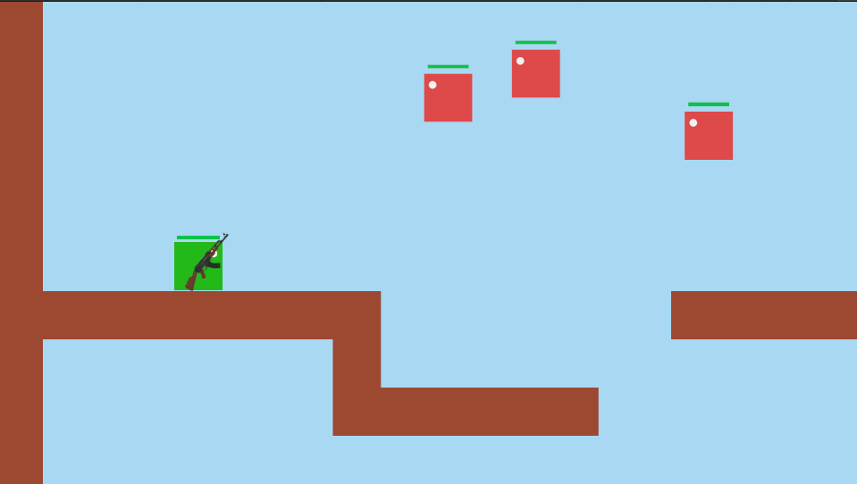

# Overview

A Unity-based 2D platformer game:
- Player movement and jumping
- Gun aiming and shooting with mouse
- Enemies that follow the player
- Health bars and damage system
- Enemy spawner that spawns enemies at random empty locations
- Game restart on player death

## Features

###  Player
- Move left/right with `A`/`D` or arrow keys.
- Jump using `Spacebar`.
- Gun follows the mouse cursor for aiming.
- Flip direction based on gun angle.
- Restarts the game if the player falls below a threshold.
- Player dies while coming in contact with a enemy and the game restarts.

### Gun & Shooting
- Shoot bullets by clicking the left mouse button.
- Bullets damage enemies and destroy on impact.
- Shooting has a cooldown to prevent spamming.

### Enemies
- Enemies spawn at random positions avoiding overlap with other objects in the given spawn area.
- They follow the player continuously.
- On bullet collision, enemies take damage and display a health bar accordingly.
- Enemies are destroyed when health reaches zero.

### Enemy
- Simple pathfinding to follow player horizontally.
- Automatically flips direction based on movement.

### Platforms
- Multiple 2D platforms placed in the scene.
- The player can jump and walk over them.

### Enemy Spawner
- Spawns the given number of enemies once at valid empty locations in the provided spawn area.
- Prevents overlapping with existing objects using collision detection.

